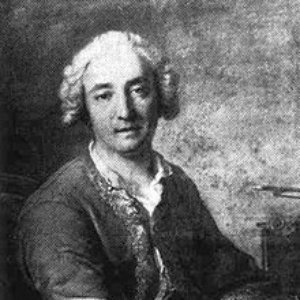
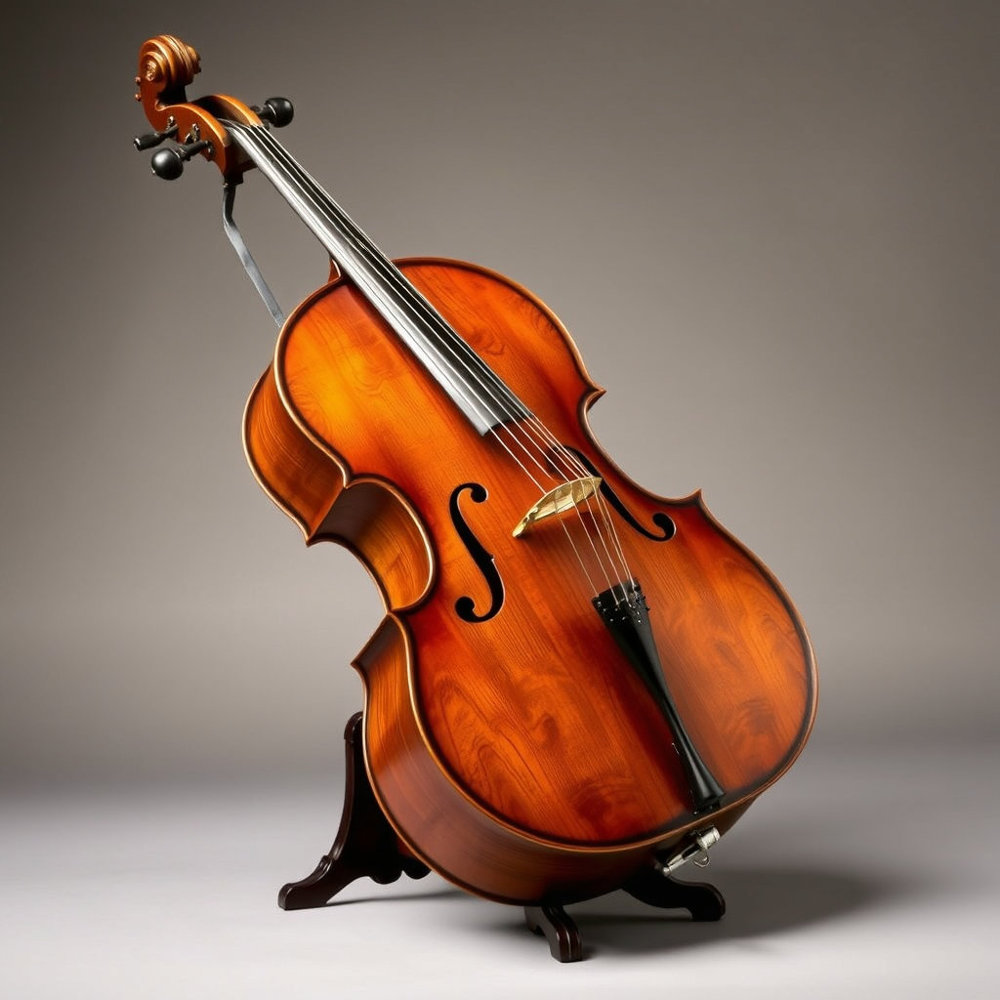

# Jean Baptiste Barriere (1707 – 1747)

[^1] [^2]

[^1]: Credit: A portrait of jean baptiste barriere by ChatGpt, Jun 10, 2025, with the prompt "Create an image of jean baptiste barriere (1707-1747)."
[^2]: Credit: * A portrait of jean baptiste barriere , [Naver blog](https://m.blog.naver.com/ebnii/221593385117) 

**Jean-Baptiste Barrière** (May 2, 1707 – June 6, 1747) was a **French cellist and composer**. He was born in Bordeaux and died in Paris, at 40 years of age. known for his contributions to cello music during the Baroque period. He was a virtuoso cellist and one of the best-known cellists of his time. His career included performing at the Académie Royale de Musique (Opera) and receiving a privilege from King Louis XV to compose and publish his works. He also toured Italy and returned to Paris to perform at the Concert Spirituel. a significant composer of the 18th century, contributing to the development of cello music. His works are technically sophisticated and emotionally rich, making them an important part of the repertoire for contemporary cellists. Barrière explored the depths of musical expression while continuing the traditions of **Baroque music** and developing his unique style. His music reflects the social and cultural currents of his time, and it continues to inspire and resonate with audiences today. 

. Key Works:
   - 6 Cello Sonatas (Sonates pour violoncelle)
   - Various chamber music pieces
   - Ballades and other instrumental works

## Table of Contents

- [A Timeline of His Life](#a-timeline-of-his-life)
- [List of Important Works](#list-of-important-works)
- [Excerpt of Pieces de clavecin](#excerpt-of-pieces-de-clavecin)
- [Listening Guide](#listening-guide)
- [Key Features of Pieces de clavecin](#key-features-of-pieces-de-clavecin)

## A Timeline of His Life

| Year | Contents |
| ---- | -------- |
| c. 1707 | Born in Bordeaux. |
| Before 1731 | Studied the viol, later mastering the cello.. |
| c. 1731 | Moved to Paris and joined the Académie Royale de Musique (Opera). |
| 1733 | Received a privilege from King Louis XV to compose and publish his works. |
| c. 1734 | Published his first book of sonatas for cello and basso continuo, Livre I. |
| c. 1735 | Published his second book of cello sonatas, Livre II. |
| 1737 | Undertook a long tour in Italy. |
| 1738 | Returned to Paris and performed at the Concert Spirituel.|
| c. 1739 | Granted a new 12-year privilege at Versailles. |
| 1740 | Published his third book of cello sonatas, Livre III.|
| 1747 | Died in Paris at the age of 40.|

[Back to TOC](#table-of-contents)

## List of Important Works

| Year | Works | YouTube |
| ---- | ----- | ------- |
| 1733 | Sonata No.1, in B minor • Livre I (first ed. 1733) | [Listen](https://www.youtube.com/watch?v=g30upVKEDwk&t=3547s) |
| 1735 | Sonata No.3, in D minor • Livre II (first ed. 1735 ca.) | [Listen](https://www.youtube.com/watch?v=g30upVKEDwk&t=3547s) |
| 1735 | Sonata No.6, in C minor • Livre II (first ed. 1735 ca.) | [Listen](https://www.youtube.com/watch?v=g30upVKEDwk&t=3547s) |
| 1736 | Sonata No.2 a tre, in D minor • Livre III (first ed. 1736 ca.) | [Listen](https://www.youtube.com/watch?v=g30upVKEDwk&t=3547s) |
| 1736 | Sonata No.4, in B♭ major • Livre III (first ed. 1736 ca.) | [Listen](https://www.youtube.com/watch?v=g30upVKEDwk&t=3547s) |
| 1740 | Sonata for Duet in G Major • Livre IV (first ed. 1737-40 ca.) | [Listen](https://www.youtube.com/watch?v=J3sWlZC84dw)|
| 1740 | Pieces de clavecin(first ed. 1740) | [Listen](https://www.youtube.com/watch?v=opqHeUnfJKM)|

## Excerpt of Pieces de clavecin

[Listen to Pieces de clavecin](https://www.youtube.com/watch?v=opqHeUnfJKM)

## Listening Guide

| Timing | Text and Form |
| ------ | ------------- |
| 0:00 - 03:11 | La Boucon |
| 03:12 - 05:49 | La Plancy |
| 05:50 - 09:15 | La Duchesne |
| 09:16 - 12:14 | La Dupont |
| 12:15 - 15:24 | La Casamajor |
| 15:25 - End | La Tribolet |

[Back to TOC](#table-of-contents)

## Key Features of Pieces de clavecin 

 A blend of French and Italian musical styles, with a strong emphasis on virtuosity, particularly in the right hand. His works often feature elaborate figurations, broken octaves, and sweeping scales, showcasing a sophisticated and demanding style of keyboard writing. While influenced by French composers like Rameau and Couperin, Barrière also incorporates Italian elements, such as bold dissonances and ornamentation, creating a unique and engaging musical voice. 

 [^3]

[Back to TOC](#table-of-contents)

[^3]: Credit: An image of cello by wrtn, Jun 10, 2025, with the prompt "Create an image of cello used during the period of jean baptiste berriere (1707-1747)."
